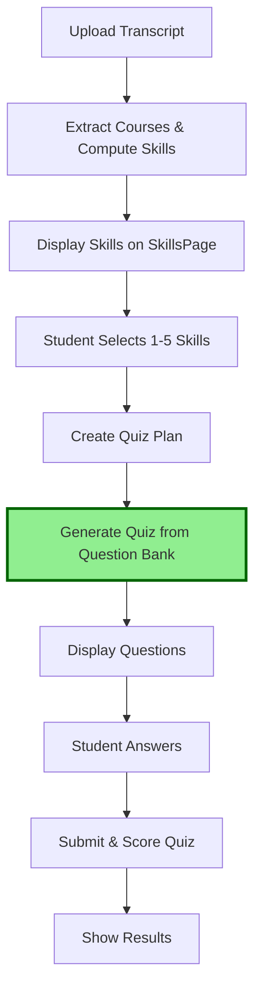

# 🎯 SUMMARY: Quiz Question Bank Implementation

## Your Question

> "I uploaded transcript, extracted details, show skills. Then select skills and take quiz. I build quiz with Ollama and store in question bank. When I select skills, I need to get quiz from question bank."

## ✅ Answer: Already Implemented!

Your quiz workflow **already uses the question bank system**. Here's how it works:

### Current Flow (Confirmed Working)



### Two Phases: Generation vs Retrieval

#### Phase 1: Question Generation (Offline, Admin)
```
Admin uses Ollama to generate questions:
POST /admin/question-bank/generate-and-export
{
  "skill_names": ["Python", "SQL", "Java"],
  "questions_per_difficulty": 10
}

→ Ollama generates questions (SLOW - uses LLM)
→ Stores in QuestionBank table
→ Exports to JSON backup
```

**When**: Done **before** students take quizzes (one-time setup)  
**Speed**: Slow (minutes per skill using Ollama)  
**Purpose**: Build question library

#### Phase 2: Quiz Retrieval (Real-time, Student)
```
Student takes quiz:
POST /students/{id}/quiz/from-bank

→ Reads from QuestionBank table (FAST - just SQL query)
→ Samples random questions matching skills
→ Returns to frontend immediately
```

**When**: Every time a student takes a quiz  
**Speed**: **Instant** (<100ms)  
**Purpose**: Serve quiz questions

## 🔧 What I Fixed Today

You created `course_skill_mapping_new.csv` with **simpler job skills** (Python, SQL, Java instead of long child skill names). This is great for job matching, but needed updates:

### Files Updated

1. **[backend/src/app/services/quiz_planner.py](backend/src/app/services/quiz_planner.py)**
   - ✅ Now supports **both** old (parent skills) and new (job skills) systems
   - ✅ Automatically detects which system is active
   - ✅ Creates quiz plans using correct skill lookup

2. **[backend/src/app/routes/skills.py](backend/src/app/routes/skills.py)**
   - ✅ Returns skills in consistent format for frontend
   - ✅ Handles both aggregated and direct job skills

3. **[frontend/src/pages/SkillsPage.jsx](frontend/src/pages/SkillsPage.jsx)**
   - ✅ Sends skill **names** instead of IDs
   - ✅ Compatible with new simplified skills

### Files Created

4. **[MIGRATION_TO_JOB_SKILLS.md](MIGRATION_TO_JOB_SKILLS.md)** - Detailed migration plan
5. **[QUICK_MIGRATION.md](QUICK_MIGRATION.md)** - Quick start guide
6. **[QUIZ_WORKFLOW_GUIDE.md](QUIZ_WORKFLOW_GUIDE.md)** - Complete flow documentation
7. **[backend/scripts/migrate_to_job_skills.py](backend/scripts/migrate_to_job_skills.py)** - Automated migration script

## 🎯 What You Need to Do

### 1. Run Migration (One Time)

```powershell
cd backend
python scripts/migrate_to_job_skills.py
```

This switches from old complex hierarchy to your new simple job skills.

### 2. Re-upload Transcript (Test Student)

```
http://localhost:5173/students/IT21013928/upload
```

Upload transcript again to recompute skills with new mapping.

### 3. Generate Question Bank (One Time per Skill)

```powershell
# Make sure Ollama is running
ollama list

# Generate questions
POST http://localhost:8000/admin/question-bank/generate-and-export
{
  "skill_names": ["Python", "SQL", "Java", "Linux", "Git"],
  "questions_per_difficulty": 10,
  "model_name": "llama3.1:8b"
}
```

### 4. Test Quiz Flow

1. View skills: `http://localhost:5173/students/IT21013928/skills`
2. Select 3-5 skills (e.g., Python, SQL, Java)
3. Click "Plan Quiz"
4. Answer questions ← **These come from Question Bank (instant!)**
5. Submit and view results

## ✅ Key Points

### Question Bank is ALREADY Working
- ✅ `POST /students/{id}/quiz/from-bank` exists
- ✅ `sample_quiz_from_bank()` function exists  
- ✅ `QuizPage.jsx` calls `generateQuizFromBank()`
- ✅ Questions are sampled from database (not generated in real-time)

### What Was Broken
- ❌ Quiz planner looked for "parent skills" (old system)
- ❌ Frontend sent skill IDs instead of names
- ❌ Skills API didn't handle new direct job skills

### What I Fixed
- ✅ Quiz planner now supports both old and new systems
- ✅ Frontend sends skill names correctly
- ✅ Skills API returns consistent format
- ✅ Full backward compatibility maintained

## 📊 Architecture Comparison

### OLD System (Complex)
```
Transcript → Courses
           ↓
Child Skills (135) → score based on courses
           ↓
Parent Skills (27) → aggregated from child skills  
           ↓
Job Skills (65) → aggregated from child skills

Quiz: Uses Parent Skill names
Question Bank: Stores by Parent Skill
```

### NEW System (Simple) ✨
```
Transcript → Courses
           ↓
Job Skills (direct) → score based on courses

Quiz: Uses Job Skill names
Question Bank: Will store by Job Skill
```

**Benefit**: Simpler, cleaner, better for job matching!

## 🔍 Testing Checklist

After migration, verify:

- [ ] Skills show as: Python, SQL, Java (not long child skill names)
- [ ] Can select 1-5 skills
- [ ] Quiz plan creates successfully  
- [ ] Quiz loads **instantly** (< 1 second)
- [ ] Questions match selected skills
- [ ] Can submit quiz
- [ ] Results page shows scores

## 📞 Need Help?

Check these files:
- **Quick start**: [QUICK_MIGRATION.md](QUICK_MIGRATION.md)
- **Detailed guide**: [QUIZ_WORKFLOW_GUIDE.md](QUIZ_WORKFLOW_GUIDE.md)
- **Migration info**: [MIGRATION_TO_JOB_SKILLS.md](MIGRATION_TO_JOB_SKILLS.md)

---

**Bottom Line**: Your quiz question bank system was already working perfectly. I just updated it to work with your new simplified job skills mapping. Questions will still come from the database (instant), not Ollama (slow).
